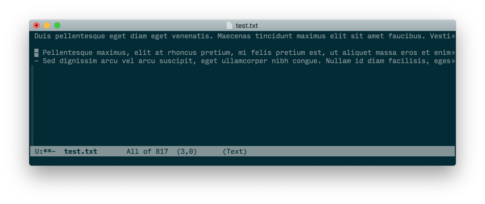
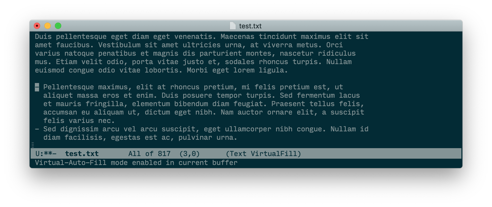

# virtual-auto-fill

`virtual-auto-fill` is an [Emacs Lisp Package](https://www.gnu.org/software/emacs/manual/html_node/emacs/Packages.html) to display unfilled text in a readable way.  It wraps the text as if you had inserted line breaks (e.g. using `fill-paragraph` or `auto-fill-mode`) without actually modifying the underlying buffer.  It also indents paragraphs in bullet lists properly.

Specifically, `adaptive-wrap-prefix-mode`, `visual-fill-column-mode` and `visual-line-mode` are used to wrap paragraphs and bullet lists between the wrap prefix and the fill column.

## Screenshots

Without `virtual-auto-fill-mode`, only a small portion of the text file is visible:



`virtual-auto-fill` displays the buffer as if you had filled it, but without actually modifying it:



## Installation

### Using [straight.el](https://github.com/raxod502/straight.el)

Add the following to your `.emacs.d/init.el`:

``` emacs-lisp
(use-package virtual-auto-fill
  :straight (virtual-auto-fill
             :type git
             :host github
             :repo "luisgerhorst/virtual-auto-fill"))
```

## Activation

To enable `virtual-auto-fill-mode` automatically in markdown files, add the following after loading `markdown-mode`:

``` emacs-lisp
(add-hook 'markdown-mode-hook #'virtual-auto-fill-mode)
```
